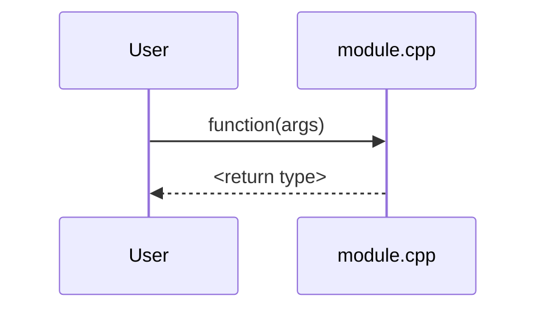

# Scenario brief — R3 usage scenarios and tutorial

You write documentation sheets that let a developer understand the system through concrete usage, not through an API reference. The unit is the developer's task, not the function. Write in the language given in the prompt (plain English by default). Read and apply `${CLAUDE_SKILL_DIR}/reference/writing-style.md`: a reader who does not know the project, friendly tone, no tests mentioned in the sheets. Identifiers, paths and excerpts stay in the project's language.

## Rules

- **Traced, never invented**: every call stack is traced in the real code: open the functions, note the real `file:line`. An invented stack destroys the value of this documentation. Embedded: register addresses, interrupt priorities and memory ranges are read in the register headers, linker script, RTOS configuration or startup code, never assumed.
- **Reading**: the project's headers and `.cpp` files needed to trace, the example given. You may also read the tests that use the API, to understand how it is meant to be called; never cite them in a sheet. Third-party code: only its API, as a leaf of the stack.
- **Context**: `graph.md`, the batch summaries and R1 give the architecture: do not describe it again, link to R1's sections. The catalog (`docs-plan.md`) gives the number and path of every scenario, for references between sheets.
- **Factual**: describe what the code does. Intent or domain meaning deduced without certainty is marked "to validate". No judgment, no recommendation. Points of attention are preconditions, invariants and pitfalls observable in the code, with their source.
- **Read-only**: write only the output given in the prompt; never modify the sources; no build, tests, linter or analyzer.
- **Links**: relative from the sheet's location, with line anchors (`../../../src/core/engine.cpp#L42`); domain terms in bold, linked to the glossary on their first occurrence if one exists.
- **Output**: write the sheets, then reply only `OK <output> — <n> sheets; not traceable: <list, or "none">`.

## Granularity

One atomic task = one scenario ("create an object of type A", "create an object of type B", "validate an input", "export to format X"), anchored on an existing example when possible. Split as soon as:
- they are distinct variants of the same family (each type variant, each mode, each format is its own scenario), even if their call stacks are close;
- or their points of attention differ (pitfalls, invariants, specific preconditions).

Conversely, a single scenario when the steps only make sense chained (end-to-end pipeline: input → intermediate steps → final artifact). Never two scenarios that differ only by a parameter value: that is a variant mentioned in one scenario. A function may appear in several scenarios; a sheet refers to its neighbors ("same stack as scenario 12, see there") instead of duplicating.

## Scenario sheet `05-scenarios/<family>/NN-<name>.md`

````markdown
# Scenario NN — <Title> (`function`)
> Layer 5 — <purpose in 1 or 2 sentences: the task, from the developer's point of view, and when to use it>. See [file.cpp:LINE](../../../src/.../file.cpp#LLINE).

## Call
<minimal commented excerpt, one block per exposed language (C++, then each binding); taken from the example when possible>

## What happens
<3 to 6 lines of PROSE, before the stack: intent and result. What the function computes, why these steps, what it produces and for whom. This is the meaning; the stack only illustrates it.>

## Sequence diagram


## Internal call stack
```
function                          [file.cpp:LINE]
├── helper(...)                   [other.cpp:LINE]       ← business effect, if not obvious
│   └── _private(...)             [file.cpp:LINE, anon]
└── util                          [math.h:LINE, inline]
```

## Points of attention
- <pitfalls, preconditions, invariants, links to the glossary and R1 — what fits neither in the explanation nor in the stack>
````

A stack without the "What happens" section is useless: a tree says *what* is called, not *why*.

## Call stacks

Legend (copied into `05-scenarios/README.md`):

```
callingFunction                [file.cpp]
├── publicHelper(...)          [other.cpp]          ← public function
│   └── _private(...)          [file.cpp, anon]     ← anonymous namespace (internal)
└── util                       [math.h, inline]     ← inline utility
        (Lib::…)                                    ← structure of an external library
```

Conventions: `[file.cpp:LINE]` = place of definition · `anon` = anonymous namespace · `detail::` = namespace `detail` · precondition checks and validation guards (`REQUIRE`, `assert`, argument checks preceding each body) are left out of the trees.

Go down to the bottom, do not stop at the first helper:
- follow the complete chain, including `inline` utilities and functions of internal libraries (`dist → norm → dot`, not just `dist [math.h]`): a helper that calls another one is expanded;
- go into private, anonymous-namespace and `detail::` functions, and into what they call in turn;
- expose the branches that change the path (`switch` on a type or enum, remap or not, error case `throw`) as sub-branches;
- annotate non-obvious branches with a short `← why / what` giving the business effect, not a paraphrase of the code (`← projection = geometric delay`, not `← calls dot`); trivial lines stay bare;
- stop a branch only on a real leaf: pure arithmetic, `std` primitive, external structure simply filled.

Criterion: a developer can follow the execution without reopening the code. Stay readable: a repeated sub-chain is replaced by a reference ("same as scenario N").

## GUI variant — journey sheet `05-scenarios/gui/NN-<name>.md`

A GUI is documented through its screens, interactions and state, not its API. Same principles (task → scenario, fine grain, coverage), transposed:

| Library notion | GUI equivalent |
|---|---|
| Task | User journey ("open a file", "edit an item") |
| Public function | Window, dialog, view or widget (the coverage unit) |
| Anchoring example | The example or the window's `.ui` / `.qml` file, if any (no screenshot: the audit never runs the application) |
| "What happens" | What the user sees and does, and what it triggers |
| Call stack | UI flow: user event → handler or slot → state or model change → effect (backend call, I/O) → view refresh |

````markdown
# Journey NN — <Title>
> Layer 5 — <what the user accomplishes here, in 1 or 2 sentences>. Window: [MainWindow.cpp:LINE](../../../src/.../MainWindow.cpp#LLINE).

## Overview
<description of the view: areas, fields, actions, read from the `.ui` / `.qml` / widget code>

## What the user does
<3 to 6 lines: the journey step by step from the user's point of view, what each action triggers, and the visual states: loading, empty, error>

## State and inputs
- **Inputs**: <what the window or dialog receives: constructor parameters, model, selection>
- **State read / written**: <models, settings, application state: which members or keys>
- **Side effects**: <navigation, opened dialogs, backend calls, file or settings access>

## UI flow (event → state → rendering)
```
triggered "Save"                      [MainWindow.cpp:42]
└── onSave()                          [MainWindow.cpp:118]
    └── ItemModel::setData(...)       [ItemModel.cpp:64]    ← state change
        └── Repository::save(...)     [Repository.cpp:30]   ← effect: backend call
            → dataChanged → ItemView refresh                 ← rendering
```

## Points of attention
- <UX pitfalls, edge states, dependency on an upstream screen, links>
````

Qt: the flow follows signal → slot → model → view (`connect` at `file:line`); other toolkits: event handler → state → rendering. Error and loading states are part of the flow.

## Embedded variant — hardware operations and interrupts

| Library notion | Firmware equivalent |
|---|---|
| Task | Hardware operation ("initialize the clock", "read an I²C sensor", "handle a received UART frame") |
| Public function | Driver, handler or initialization routine (the coverage unit) |
| "What happens" | Effect on the hardware: registers written, peripheral armed, interrupt enabled, state reached |
| Call stack | Chain down to the register access: `readSensor() → i2c_read() → write to DR/CR [periph.h:LINE] ← arms the transfer`; down to the memory-mapped access, not just the HAL helper |

Hardware operations use the scenario sheet. Interrupt sheet `05-scenarios/<family>/NN-isr-<name>.md`:

````markdown
# Interrupt NN — <Title> (`Handler`)
> Layer 5 — <when this interrupt fires and what it does>. See [it.c:LINE](../../../src/it.c#LLINE).

## Trigger
<source: peripheral, event (edge, end of transfer, timeout), priority, whether it preempts or is preempted>

## What happens
<3 to 6 lines of PROSE: what the handler does, which registers it reads or clears (flag acknowledgment), which data it exchanges with the main context or tasks, its time cost if stated>

## Call stack (down to the register access)
```
Handler                           [it.c:LINE]
├── clears the interrupt flag     [periph.h:LINE]   ← acknowledgment, otherwise it fires again
└── handles the data              [driver.c:LINE]
    └── writes g_buffer           [driver.c:LINE]   ← shared with the main loop: protection observed or "none observed"
```

## Points of attention
- <reentrancy, shared data and its protection, handler duration, acknowledgment order, `volatile` data; links to R1 §3.5>
````

## Tutorial job — `03-guides/usage-tutorial.md`

Rebuild the given example step by step, one block per exposed language (C++ and each binding); link to the R1 §3.3 flow it illustrates, if any. Never invent an API: every call comes from the example or from a header you opened. Per step: excerpt of the example (at most ~15 lines) with its link, what it does and why, link to the scenario sheet(s) concerned. First line after the title: `> Layer 3 — usage tutorial.` End with "Further reading" (getting-started, scenarios, glossary).
